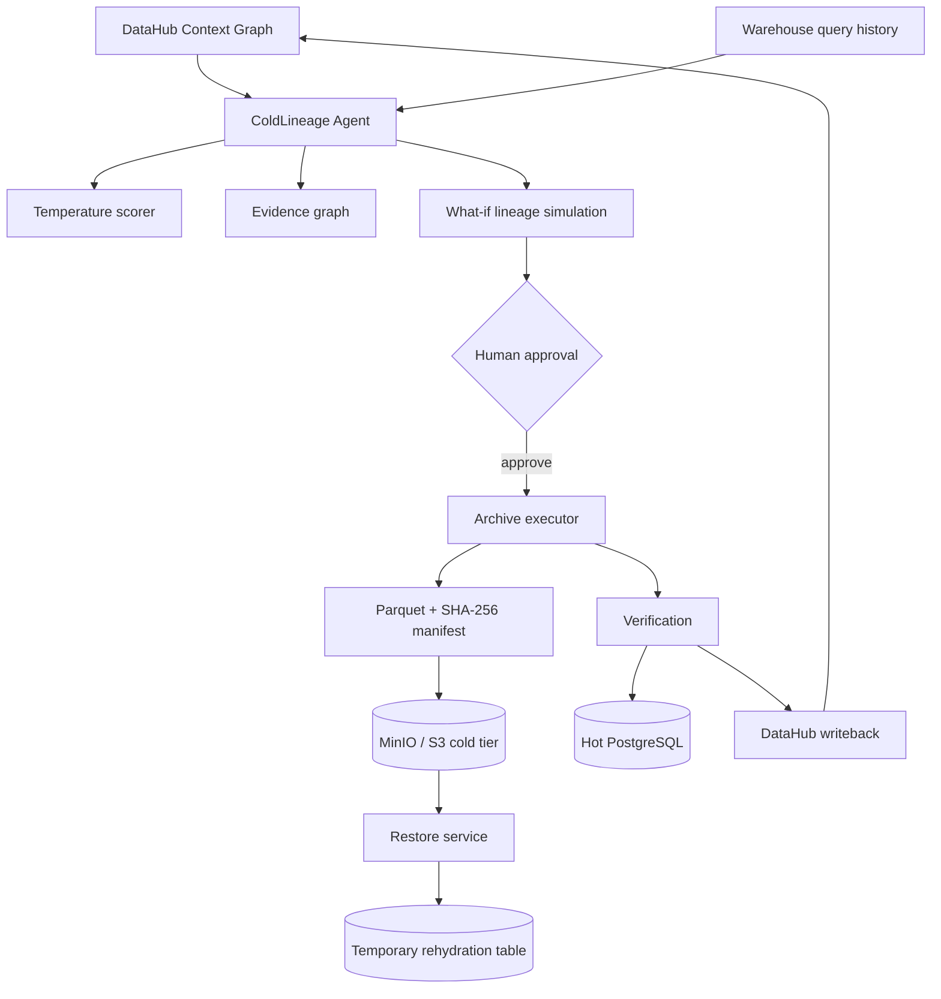

# ColdLineage architecture

## Trust boundaries
- The reasoning layer never receives unrestricted DDL/DML authority.
- The executor exposes constrained operations: preview, simulate, execute, restore.
- Human approval gates destructive movement.
- Archive verification occurs before hot data removal.
- Restore verifies SHA-256 before rehydration.
