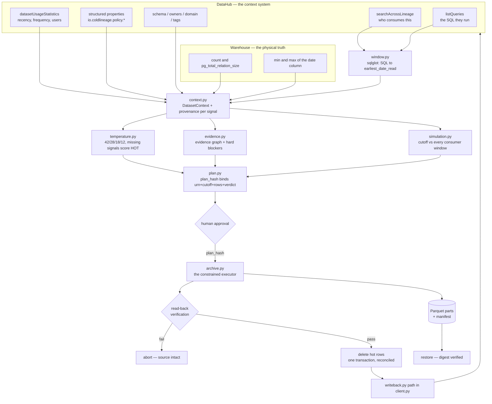

# ColdLineage architecture

## The one decision this system makes

> Is it safe to move rows older than **C** out of table **T**?

Answering it requires one fact DataHub does not compute: **how far back each downstream consumer
actually reads.** Everything below exists to derive that fact honestly and then act on it without
being able to do damage.

## Flow



## Module map

| Module | Responsibility | Why it is separate |
|---|---|---|
| `datahub/queries.py` | GraphQL documents | Each read is its own document, so a missing aspect on one DataHub version costs one signal, not the whole context. All validated against a live v1.7.0 schema. |
| `datahub/client.py` | Transport, cassettes, writeback | Every call routes through `_execute`, which can record or replay. That is what makes an offline demo possible without lying about the source. |
| `datahub/properties.yaml` | Typed property vocabulary | Policy inputs and archive outputs are first-class, validated, `entity_types`-scoped — not an untyped `customProperties` smear. |
| `services/window.py` | **SQL → history window** | The differentiator. Pure, deterministic, no I/O, therefore fully testable — see `backend/tests/`. |
| `services/context.py` | Assemble `DatasetContext` | The only place that talks to both DataHub and the warehouse. Attaches provenance to every value. |
| `services/temperature.py` | Score 0–100 | Deterministic and published, so an owner can reproduce it by hand. |
| `services/evidence.py` | Evidence graph + hard blockers | Blockers are kept *out* of the score: a legal hold must not be out-voted by a low temperature. |
| `services/simulation.py` | Cutoff → verdict | The only component that knows what "safe" means. |
| `services/plan.py` | Plan hash + approval gate | Makes approval unforgeable and makes staleness detectable. |
| `services/archive.py` | Move bytes | The only component with delete authority, exposing four operations and nothing else. |

## Three invariants

**1. Nothing is invented.** Every field in `DatasetContext` carries a `Provenance`. When a read
fails the value is `None` with `Source.UNAVAILABLE`, and the UI renders a gap. There is no code path
that substitutes a plausible default for a missing measurement. `DEMO_MODE` was deleted for exactly
this reason; `replay` serves verbatim recorded GMS responses tagged `cassette:recorded`.

**2. Unproven means blocked.** Ambiguity always resolves toward refusing the archive:

| Situation | Resolution |
|---|---|
| No date predicate in a consumer's SQL | unbounded → blocks |
| `OR` with an unconstrained branch | unbounded → blocks |
| SQL fails to parse | unbounded → blocks |
| Subject read inside a CTE, filtered outside | unbounded → blocks |
| Lineage unreadable | `DO_NOT_ARCHIVE` — the consumer set is unknown |
| Usage telemetry missing | temperature scores **hot**, not cold |
| Policy unreadable | `POLICY_UNAVAILABLE` blocker |

Note the temperature inversion. Treating "no usage data" as "nobody uses it" is the bug that
deletes production data.

**3. Verify the stored object, not the intent.** `execute` orders operations so the source is
recoverable at every point before the delete:

```
stream chunks → upload parts → upload manifest
   → GET the parts back from object storage
   → recompute SHA-256 on the RETRIEVED bytes
   → re-read Parquet, assert row count and column set
   → only now DELETE, in one transaction
   → re-count; any mismatch rolls back
```

## Trust boundary

The reasoning layer — the DataHub Skill, or any agent — never holds database credentials. It calls
`plan`, `simulate`, `execute`, `restore` and nothing else. `execute` requires a plan hash over
`{urn, cutoff, rows_in_scope, recommendation, blocker_codes}`; the service recomputes it from live
state and refuses on mismatch, so an approval cannot be replayed against drifted data.

This is deliberately the opposite of giving a model a database connection and a good prompt. The
guarantee comes from what the executor *cannot* be asked to do.

## Deliberate non-goals

- **Not a detection tool.** DataHub's Metadata Tests already finds cold tables. ColdLineage assumes
  detection and solves the part that follows.
- **Not a metadata-only lifecycle tool.** Soft delete, deprecation and DataHubGC already cover that.
  This moves bytes.
- **Not multi-platform.** Postgres only. Other platforms appear as consumers, never as candidates,
  because we cannot move what we cannot reach.
