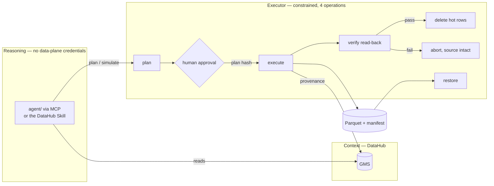

# ColdLineage

**DataHub can tell you a table is cold. It cannot tell you that _half_ a table is cold — and it cannot move a single byte. ColdLineage does both, and writes the receipt back into DataHub.**

Built for [Build with DataHub: The Agent Hackathon](https://datahub.devpost.com/).
Challenge category: **Agents That Do Real Work**.

---

## The problem, stated precisely

Every data platform team has a stalled "what can we drop?" project. It stalls because nobody can
prove a deletion is safe, so nothing gets deleted, and the warehouse bill compounds.

DataHub already solves the *detection* half of this, and solves it well. Metadata Tests can
continuously find tables in the bottom quartile of usage. Impact Analysis shows what depends on
them. Deprecation and soft-delete mark them. DPG Media cut Snowflake spend 25% doing exactly that.
**None of that is what this project claims to add.**

Two things remain, and they are the two that actually block the work:

1. **DataHub's model is dataset- and column-level.** It can say "this table is unused". It has no
   way to say *"rows before 2023 are cold while the last 90 days are hot"*. Partition-level
   metadata is still an open feature request. So the enormous middle case — a **heavily-queried
   table whose first four years nobody has read in years** — is invisible to dataset-level tiering.
   That case is most of the savings, and it is the one that terrifies people, because archiving a
   live table feels reckless.

2. **Nothing in DataHub moves data.** Soft delete, DataHubGC, deprecation and Metadata Tests all
   operate strictly on metadata. DataHubGC deletes stale *metadata* rows by age; it has never moved
   a byte of warehouse data.

ColdLineage occupies exactly that gap.

## How it decides

The question "is this date range safe to archive?" reduces to one measurable thing:

> **How far back does each downstream consumer actually read?**

DataHub knows *that* a dashboard depends on a table. It does not know that the dashboard only ever
reads the trailing twelve months. But it does hold the dashboard's **real SQL**, as Query entities.

So ColdLineage reads that SQL out of DataHub and parses it with `sqlglot`, resolving the lower
bound each consumer places on the subject's date column into a concrete date:

| Predicate in the consumer's real SQL | Resolved history window |
|---|---|
| `event_date BETWEEN DATE '2024-01-01' AND CURRENT_DATE` | 2024-01-01 |
| `event_date >= CURRENT_DATE - INTERVAL '90 days'` | 2026-05-08 |
| `date_trunc('month', event_date) >= date_trunc('month', CURRENT_DATE - INTERVAL '18 months')` | 2025-02-01 |
| `event_date > (CURRENT_TIMESTAMP - INTERVAL '24 months')::date` | 2024-08-06 |
| `WHERE performing_lab IS NOT NULL` | **unbounded — blocks every cutoff** |

A cutoff is safe **iff it is no later than the earliest window across all active consumers.**

That last row is the whole point. It *has* a `WHERE` clause, so a "does this query filter?"
heuristic passes it. It has no date bound, so it reads every row ever written.

### Everything unproven blocks

The parser is deliberately pessimistic, because getting this backwards deletes data someone was
still reading. All of these resolve to *unbounded*, which refuses the archive:

- no date predicate at all
- a boolean `OR` where any branch is unconstrained
- `NOT` over a date predicate
- a bound we can parse but cannot resolve to a date
- the subject read inside a CTE whose outer query filters it
- SQL we fail to parse
- **lineage we could not read at all** — absence of evidence is not evidence of safety

Under `AND` the effective bound is the *latest* of the branch bounds; under `OR`, the *earliest*,
and unbounded is contagious. 20 tests in
[`backend/tests/test_window_extraction.py`](backend/tests/test_window_extraction.py) pin this down.

## How DataHub is used

Not as a decoration on the side of a local database. **Every decision input is read from DataHub at
request time**, and every value carries a provenance tag that is rendered in the UI, so a missing
input shows up as a visible gap rather than a plausible-looking number.

**Read** (GraphQL against GMS — every document validated against a live v1.7.0 schema):

| Signal | Source |
|---|---|
| Downstream consumers | `searchAcrossLineage` |
| The SQL each one runs | `listQueries` → `queryProperties.statement` |
| Usage: last query, 30d count, distinct users | `datasetUsageStatistics` |
| Retention floor, legal hold, business criticality | structured properties `io.coldlineage.policy.*` |
| Schema, date column, owners, domain, tags, terms | `schemaMetadata`, `ownership`, `domain`, `tags` |

**Write** — four contributions back to the graph after a verified archive:

| Contribution | Mutation | Why |
|---|---|---|
| 6 typed archive properties | `upsertStructuredProperties` | machine-readable facts, validated and scoped |
| Deprecation note + `decommissionTime` | `updateDeprecation` | the warning a human sees on the entity |
| Manifest link | `addLink` | where the bytes went, clickable |
| `cold-tier-archived` tag | `addTag` | makes the archived set searchable |

Deliberately **not** done: writing the `datasetProperties` aspect wholesale. That aspect holds other
writers' custom properties and a whole-aspect PUT silently destroys them. Structured properties are
typed, validated, `entity_types`-scoped, and survive other writers. The definitions are committed in
[`backend/app/datahub/properties.yaml`](backend/app/datahub/properties.yaml).

**Ingest** uses the first-party `postgres` connector plus the `acryl-datahub` Python SDK, so the
demo estate is real catalog content with real URNs — not hand-built fixtures.

**Agent surface** — two, sharing one executor:

| | |
|---|---|
| [`agent/`](agent/) | A standalone agent (`claude-opus-5`) that **reads DataHub through the official [MCP Server](https://github.com/acryldata/mcp-server-datahub)** — `search`, `get_lineage`, `get_dataset_queries`, `get_entities`, `list_schema_fields`, `get_lineage_paths_between` — and acts through five constrained operations, blocking on a human before any delete. |
| [`skills/assess-data-temperature/`](skills/assess-data-temperature/) | The same decision procedure as a **loadable DataHub Skill**, for anyone already in a skills runtime (Claude Code, Cursor, …), driving the `datahub` CLI. |

Neither holds database credentials. See [Trust boundary](#trust-boundary).

## Two commands

Requires Docker Desktop (≥8 GB to Docker) and Python 3.11+.

```bash
# 1. DataHub itself — a real external catalog, exactly as it would be in your environment
pip install 'acryl-datahub[datahub-rest]'
datahub docker quickstart

# 2. ColdLineage
git clone https://github.com/Abhinav0905/ColdLineage.git
cd ColdLineage
make demo          # brings up Postgres + MinIO + API + UI, seeds 3.65M rows, ingests into DataHub
```

| | |
|---|---|
| ColdLineage UI | http://localhost:3100 |
| API docs | http://localhost:8000/docs |
| DataHub | http://localhost:9002 |
| MinIO console | http://localhost:9001 (`minioadmin` / `minioadmin`) |

**If a port is already taken** (8080 and 3000 are common), override and re-run:

```bash
DATAHUB_GMS_URL=http://host.docker.internal:8090 docker compose up -d
```

**No DataHub? Run the recorded catalog.** `DATAHUB_MODE=replay` serves verbatim GMS responses
committed in [`examples/cassettes/`](examples/cassettes/). The UI labels the mode and the recording
timestamp, and every signal is tagged `cassette:recorded` rather than `datahub:*`.
There is deliberately **no third mode that invents context.**

## The demo estate

Five synthetic healthcare tables, **3,650,000 rows / 566 MB measured** (`pg_total_relation_size`,
never declared). Four different date-column names on purpose — a parser that hardcodes one looks
like it works and is wrong.

| Table | What it isolates |
|---|---|
| **`patient_encounters`** | **The hero.** Temperature **81.3 HOT** — genuinely in active use — yet 516,088 rows (46.9%) sit before 2023 and every consumer reads no earlier than 2024-01-01. **Archivable.** |
| **`lab_results`** | **The killer.** Temperature **10.8 COLD** — 0 queries, 0 users in 30 days. Every dataset-level tool archives it tomorrow. **Blocked at every possible cutoff** — one HIPAA extract does an unbounded scan. |
| `claims_history` | ACTIVE legal hold (`MDL-2291`) as a DataHub structured property. Range analysis approves; policy vetoes. |
| `care_events_live` | Genuinely hot; the 2-year retention floor lands before the table starts. |
| `billing_ledger` | Consumers clear a 2022 cutoff; the 7-year retention floor does not. Same table, different cutoff, different answer. |

Those two rows are the entire argument:

```
patient_encounters   81.3 HOT    -> archivable      (46.9% of it is provably unread)
lab_results          10.8 COLD   -> blocked         (at every cutoff, forever)
```

**Dataset-level temperature gets both of them exactly backwards.** Only reading each consumer's
actual SQL separates them.

## Verified run

Against DataHub OSS v1.7.0, reproducible with `make examples`:

```
patient_encounters   1,100,000 rows / 178 MB / event_date 2019-01-01 .. 2026-08-05
  temperature 81.3 HOT, archive_eligible: true

cutoff sweep
  2022-01-01  SAFE_TO_ARCHIVE           +730d
  2023-06-01  SAFE_TO_ARCHIVE           +214d
  2023-11-15  ARCHIVE_WITH_REHYDRATION   +47d
  2024-03-01  DO_NOT_ARCHIVE             -60d   blocked by Quarterly Compliance Dashboard

EXECUTE cutoff=2023-01-01
  516,088 rows -> 11 Parquet parts -> s3://coldlineage-archive/...
  read-back digest match: true | rows 516,088/516,088 | schema match: true
  -> source deleted only after verification.  1,100,000 -> 583,912
  DataHub writeback: 4/4 operations ok

RESTORE  516,088 rows rehydrated, SHA-256 verified
```

## Trust boundary



The reasoning layer never receives DDL/DML authority — no database credentials, no object-store
client, no ability to issue SQL. It gets read-only MCP tools plus five constrained operations, and
that tool list is the guarantee: it holds even if the model is wrong or the prompt is attacked.
A human stands between plan and execute. **Approval is a plan hash** binding dataset + cutoff +
row count + verdict — if live state drifted since the plan was shown, execution is refused rather
than proceeding against different data.

This is deliberately the opposite of handing a model a database connection and a careful prompt.

And the ordering inside `execute` is the safety argument:

1. stream rows out in chunks → multi-part Parquet
2. upload parts, then the manifest
3. **download the parts back from object storage**
4. recompute SHA-256 on the *retrieved* bytes and compare
5. re-read the Parquet, assert row count and column set
6. only then delete — in one transaction
7. re-count; roll back on any mismatch

Step 3 is the one that matters. Hashing the buffer you are *about* to upload proves nothing about
what landed.

## What is honest about the numbers

At demo scale the storage saving is **about one cent a month**. 516,088 rows is 93 MB, and no amount
of framing makes that a business case. The API reports the measured figure alongside the unit rate
($113.66/TB-month at S3 Standard → Glacier IR) and the archived fraction, and does not round the
measured one up into looking impressive.

**What transfers is the fraction, not the dollars**: 46.9% of a live, actively-queried table turned
out to be provably unread. Applied to a real estate that ratio is the entire argument, and it is
measured, not modelled.

Also stated plainly: rows are exact; per-range **byte figures are estimates** — the table's measured
physical size apportioned by row share, because Postgres does not track per-range size. Every
estimate is labelled as one in the API response.

## Limitations

- **Postgres only.** The executor moves Postgres → Parquet. Other platforms appear in lineage as
  consumers but are not archive candidates; listing a Snowflake table as archivable when the only
  executor is Postgres would be a claim the product cannot honour.
- **Restore of ~500k rows takes ~75s.** Correct, not fast; it round-trips through pandas.
- **The estate is synthetic.** Every ingested entity is stamped `coldlineage.synthetic=true`.
  Row counts, byte sizes, column types and date ranges are measured from the live database.
- **Multi-hop consumers inherit** the earliest bound of their upstreams rather than an exact
  mediated edge. This can over-protect — block a cutoff that was in fact safe — never the reverse.
- `searchAcrossLineage` lags the graph index by ~1 minute after ingestion.

## Layout

| Path | |
|---|---|
| [`backend/app/services/window.py`](backend/app/services/window.py) | **the differentiator** — SQL → history window |
| [`backend/app/services/simulation.py`](backend/app/services/simulation.py) | cutoff → verdict |
| [`backend/app/services/archive.py`](backend/app/services/archive.py) | the constrained executor |
| [`backend/app/datahub/`](backend/app/datahub/) | GraphQL reads, writeback, cassettes, property definitions |
| [`agent/`](agent/) | the MCP-driven agent — the tool list *is* the security model |
| [`skills/assess-data-temperature/`](skills/assess-data-temperature/) | the loadable DataHub Skill |
| [`scripts/`](scripts/) | estate, consumers + their real SQL, DataHub ingestion |
| [`examples/`](examples/) | artifacts from a real run — readable without running anything |
| [`CONTRIBUTING-UPSTREAM.md`](CONTRIBUTING-UPSTREAM.md) | proposed upstream contributions to DataHub |

## Upstream contributions

While building this we found that DataHub's own
`skills/datahub-enrich/references/mutation-reference.md` documents `upsertStructuredProperties`
incorrectly — the example fails schema validation three ways (`structuredPropertyInputs` should be
`structuredPropertyInputParams`, `values` takes `[PropertyValueInput!]!` not bare strings, and the
mutation returns `StructuredProperties!` so it needs a selection set). Proof and a draft PR are in
[`CONTRIBUTING-UPSTREAM.md`](CONTRIBUTING-UPSTREAM.md), alongside a proposal to contribute this
skill upstream — `datahub-skills` currently has no skill covering cost, storage, tiering, retention,
archival or lifecycle.

## License

Apache-2.0. See [LICENSE](LICENSE).
